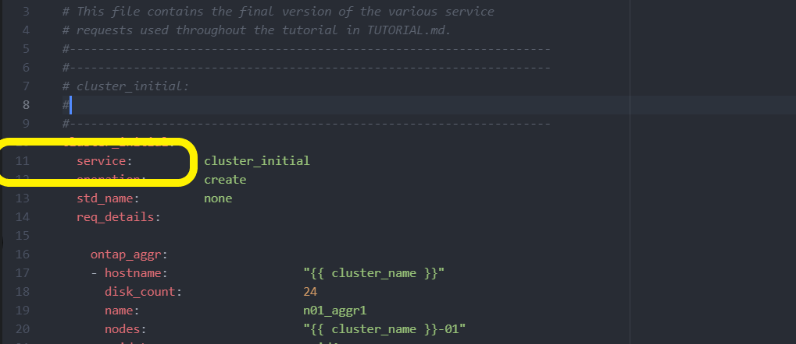

= Déployez le cluster ONTAP à l'aide de la solution
:hardbreaks:
:allow-uri-read: 
:nofooter: 
:icons: font
:linkattrs: 
:imagesdir: ../media/

[role="lead"]
Une fois la préparation et la planification terminée, vous êtes prêt à utiliser la solution ONTAP Day 0/1 pour configurer rapidement un cluster ONTAP à l'aide d'Ansible.

À tout moment au cours des étapes de cette section, vous pouvez choisir de tester une demande au lieu de l'exécuter. Pour tester une demande, remplacez le `site.yml` PlayBook sur la ligne de commande par `logic.yml`.

NOTE: L' `docs/tutorial-requests.txt`emplacement contient la version finale de toutes les demandes de service utilisées tout au long de cette procédure. Si vous avez des difficultés à exécuter une demande de service, vous pouvez copier la demande pertinente du `tutorial-requests.txt` fichier vers l' `playbooks/inventory/group_vars/all/tutorial-requests.yml`emplacement et modifier les valeurs codées en dur comme requis (adresse IP, noms d'agrégats, etc.). Vous devriez alors être en mesure d'exécuter la demande avec succès.

== Avant de commencer

* Ansible doit être installé sur votre système.
* Vous devez avoir téléchargé la solution ONTAP Day 0/1 et extrait le dossier à l'emplacement souhaité sur le nœud de contrôle Ansible.
* L'état du système ONTAP doit répondre aux exigences et vous devez disposer des informations d'identification nécessaires.
* Vous devez avoir effectué toutes les tâches requises décrites dans la link:ontap-day01-prepare.html["Préparation"] section.

NOTE: Dans les exemples de cette solution, on utilise les noms « Cluster_01 » et « Cluster_02 » pour les deux clusters. Vous devez remplacer ces valeurs par les noms des clusters de votre environnement.

== Étape 1 : configuration initiale du cluster

À ce stade, vous devez effectuer certaines étapes initiales de configuration du cluster.

.Étapes
. Naviguez jusqu'à `playbooks/inventory/group_vars/all/tutorial-requests.yml` l'emplacement et examinez la `cluster_initial` demande dans le fichier. Apportez les modifications nécessaires à votre environnement.
. Créez un fichier dans le `logic-tasks` dossier de la demande de service. Par exemple, créez un fichier appelé `cluster_initial.yml`.
+
Copiez les lignes suivantes dans le nouveau fichier :

+
[source, cli]
----
- name: Validate required inputs
  ansible.builtin.assert:
    that:
    - service is defined

- name: Include data files
  ansible.builtin.include_vars:
    file:   "{{ data_file_name }}.yml"
  loop:
  - common-site-stds
  - user-inputs
  - cluster-platform-stds
  - vserver-common-stds
  loop_control:
    loop_var:    data_file_name

- name: Initial cluster configuration
  set_fact:
    raw_service_request:
----
. Définissez la `raw_service_request` variable.
+
Vous pouvez utiliser l'une des options suivantes pour définir la `raw_service_request` variable dans `cluster_initial.yml` le fichier que vous avez créé dans le `logic-tasks` dossier :

+
** *Option 1* : définissez manuellement la `raw_service_request` variable.
+
Ouvrez le `tutorial-requests.yml` fichier à l'aide d'un éditeur et copiez le contenu de la ligne 11 à la ligne 165. Collez le contenu sous la `raw service request` variable dans le nouveau `cluster_initial.yml` fichier, comme indiqué dans les exemples suivants :

+

+
.Montrer l'exemple
[%collapsible]
====
Exemple de `cluster_initial.yml` fichier :

[listing]
----
- name: Validate required inputs
  ansible.builtin.assert:
    that:
    - service is defined

- name: Include data files
  ansible.builtin.include_vars:
    file:   "{{ data_file_name }}.yml"
  loop:
  - common-site-stds
  - user-inputs
  - cluster-platform-stds
  - vserver-common-stds
  loop_control:
    loop_var:    data_file_name

- name: Initial cluster configuration
  set_fact:
    raw_service_request:
     service:          cluster_initial
     operation:         create
     std_name:           none
     req_details:

      ontap_aggr:
      - hostname:                   "{{ cluster_name }}"
        disk_count:                 24
        name:                       n01_aggr1
        nodes:                      "{{ cluster_name }}-01"
        raid_type:                  raid4

      - hostname:                   "{{ peer_cluster_name }}"
        disk_count:                 24
        name:                       n01_aggr1
        nodes:                      "{{ peer_cluster_name }}-01"
        raid_type:                  raid4

      ontap_license:
      - hostname:                   "{{ cluster_name }}"
        license_codes:
        - XXXXXXXXXXXXXXAAAAAAAAAAAAAA
        - XXXXXXXXXXXXXXAAAAAAAAAAAAAA
        - XXXXXXXXXXXXXXAAAAAAAAAAAAAA
        - XXXXXXXXXXXXXXAAAAAAAAAAAAAA
        - XXXXXXXXXXXXXXAAAAAAAAAAAAAA
        - XXXXXXXXXXXXXXAAAAAAAAAAAAAA
        - XXXXXXXXXXXXXXAAAAAAAAAAAAAA
        - XXXXXXXXXXXXXXAAAAAAAAAAAAAA
        - XXXXXXXXXXXXXXAAAAAAAAAAAAAA
        - XXXXXXXXXXXXXXAAAAAAAAAAAAAA
        - XXXXXXXXXXXXXXAAAAAAAAAAAAAA
        - XXXXXXXXXXXXXXAAAAAAAAAAAAAA
        - XXXXXXXXXXXXXXAAAAAAAAAAAAAA
        - XXXXXXXXXXXXXXAAAAAAAAAAAAAA
        - XXXXXXXXXXXXXXAAAAAAAAAAAAAA
        - XXXXXXXXXXXXXXAAAAAAAAAAAAAA
        - XXXXXXXXXXXXXXAAAAAAAAAAAAAA
        - XXXXXXXXXXXXXXAAAAAAAAAAAAAA
        - XXXXXXXXXXXXXXAAAAAAAAAAAAAA
        - XXXXXXXXXXXXXXAAAAAAAAAAAAAA
        - XXXXXXXXXXXXXXAAAAAAAAAAAAAA
        - XXXXXXXXXXXXXXAAAAAAAAAAAAAA
        - XXXXXXXXXXXXXXAAAAAAAAAAAAAA
        - XXXXXXXXXXXXXXAAAAAAAAAAAAAA
        - XXXXXXXXXXXXXXAAAAAAAAAAAAAA
        - XXXXXXXXXXXXXXAAAAAAAAAAAAAA
        - XXXXXXXXXXXXXXAAAAAAAAAAAAAA
        - XXXXXXXXXXXXXXAAAAAAAAAAAAAA
        - XXXXXXXXXXXXXXAAAAAAAAAAAAAA
        - XXXXXXXXXXXXXXAAAAAAAAAAAAAA
        - XXXXXXXXXXXXXXAAAAAAAAAAAAAA

    - hostname:                   "{{ peer_cluster_name }}"
      license_codes:
        - XXXXXXXXXXXXXXAAAAAAAAAAAAAA
        - XXXXXXXXXXXXXXAAAAAAAAAAAAAA
        - XXXXXXXXXXXXXXAAAAAAAAAAAAAA
        - XXXXXXXXXXXXXXAAAAAAAAAAAAAA
        - XXXXXXXXXXXXXXAAAAAAAAAAAAAA
        - XXXXXXXXXXXXXXAAAAAAAAAAAAAA
        - XXXXXXXXXXXXXXAAAAAAAAAAAAAA
        - XXXXXXXXXXXXXXAAAAAAAAAAAAAA
        - XXXXXXXXXXXXXXAAAAAAAAAAAAAA
        - XXXXXXXXXXXXXXAAAAAAAAAAAAAA
        - XXXXXXXXXXXXXXAAAAAAAAAAAAAA
        - XXXXXXXXXXXXXXAAAAAAAAAAAAAA
        - XXXXXXXXXXXXXXAAAAAAAAAAAAAA
        - XXXXXXXXXXXXXXAAAAAAAAAAAAAA
        - XXXXXXXXXXXXXXAAAAAAAAAAAAAA
        - XXXXXXXXXXXXXXAAAAAAAAAAAAAA
        - XXXXXXXXXXXXXXAAAAAAAAAAAAAA
        - XXXXXXXXXXXXXXAAAAAAAAAAAAAA
        - XXXXXXXXXXXXXXAAAAAAAAAAAAAA
        - XXXXXXXXXXXXXXAAAAAAAAAAAAAA
        - XXXXXXXXXXXXXXAAAAAAAAAAAAAA
        - XXXXXXXXXXXXXXAAAAAAAAAAAAAA
        - XXXXXXXXXXXXXXAAAAAAAAAAAAAA
        - XXXXXXXXXXXXXXAAAAAAAAAAAAAA
        - XXXXXXXXXXXXXXAAAAAAAAAAAAAA
        - XXXXXXXXXXXXXXAAAAAAAAAAAAAA
        - XXXXXXXXXXXXXXAAAAAAAAAAAAAA
        - XXXXXXXXXXXXXXAAAAAAAAAAAAAA
        - XXXXXXXXXXXXXXAAAAAAAAAAAAAA
        - XXXXXXXXXXXXXXAAAAAAAAAAAAAA

    ontap_motd:
    - hostname:                   "{{ cluster_name }}"
      vserver:                    "{{ cluster_name }}"
      message:                    "New MOTD"

    - hostname:                   "{{ peer_cluster_name }}"
      vserver:                    "{{ peer_cluster_name }}"
      message:                    "New MOTD"

    ontap_interface:
    - hostname:                   "{{ cluster_name }}"
      vserver:                    "{{ cluster_name }}"
      interface_name:             ic01
      role:                       intercluster
      address:                    10.0.0.101
      netmask:                    255.255.255.0
      home_node:                  "{{ cluster_name }}-01"
      home_port:                  e0c
      ipspace:                    Default
      use_rest:                   never

    - hostname:                   "{{ cluster_name }}"
      vserver:                    "{{ cluster_name }}"
      interface_name:             ic02
      role:                       intercluster
      address:                    10.0.0.101
      netmask:                    255.255.255.0
      home_node:                  "{{ cluster_name }}-01"
      home_port:                  e0c
      ipspace:                    Default
      use_rest:                   never

    - hostname:                   "{{ peer_cluster_name }}"
      vserver:                    "{{ peer_cluster_name }}"
      interface_name:             ic01
      role:                       intercluster
      address:                    10.0.0.101
      netmask:                    255.255.255.0
      home_node:                  "{{ peer_cluster_name }}-01"
      home_port:                  e0c
      ipspace:                    Default
      use_rest:                   never

    - hostname:                   "{{ peer_cluster_name }}"
      vserver:                    "{{ peer_cluster_name }}"
      interface_name:             ic02
      role:                       intercluster
      address:                    10.0.0.101
      netmask:                    255.255.255.0
      home_node:                  "{{ peer_cluster_name }}-01"
      home_port:                  e0c
      ipspace:                    Default
      use_rest:                   never

    ontap_cluster_peer:
    - hostname:                   "{{ cluster_name }}"
      dest_cluster_name:          "{{ peer_cluster_name }}"
      dest_intercluster_lifs:     "{{ peer_lifs }}"
      source_cluster_name:        "{{ cluster_name }}"
      source_intercluster_lifs:   "{{ cluster_lifs }}"
      peer_options:
        hostname:                 "{{ peer_cluster_name }}"

----
====
** *Option 2* : utilisez un modèle Jinja pour définir la demande :
+
Vous pouvez également utiliser le format de modèle Jinja suivant pour obtenir la `raw_service_request` valeur.

+
`raw_service_request:      "{{ cluster_initial }}"`

. Effectuez la configuration initiale du cluster pour le premier cluster :
+
[source, cli]
----
ansible-playbook -i inventory/hosts site.yml -e cluster_name=<Cluster_01>
----
+
Vérifiez qu'il n'y a pas d'erreur avant de continuer.

. Répéter la commande pour le second cluster :
+
[source, cli]
----
ansible-playbook -i inventory/hosts site.yml -e cluster_name=<Cluster_02>
----
+
Vérifiez qu'il n'y a pas d'erreur pour le second cluster.

+
Lorsque vous faites défiler vers le haut vers le début de la sortie Ansible, vous devez voir la demande qui a été envoyée à la structure, comme illustré ci-dessous :

+
.Montrer l'exemple
[%collapsible]
====
[listing]
----
TASK [Show the raw_service_request] ************************************************************************************************************
ok: [localhost] => {
    "raw_service_request": {
        "operation": "create",
        "req_details": {
            "ontap_aggr": [
                {
                    "disk_count": 24,
                    "hostname": "Cluster_01",
                    "name": "n01_aggr1",
                    "nodes": "Cluster_01-01",
                    "raid_type": "raid4"
                }
            ],
            "ontap_license": [
                {
                    "hostname": "Cluster_01",
                    "license_codes": [
                        "XXXXXXXXXXXXXXXAAAAAAAAAAAA",
                        "XXXXXXXXXXXXXXAAAAAAAAAAAAA",
                        "XXXXXXXXXXXXXXAAAAAAAAAAAAA",
                        "XXXXXXXXXXXXXXAAAAAAAAAAAAA",
                        "XXXXXXXXXXXXXXAAAAAAAAAAAAA",
                        "XXXXXXXXXXXXXXAAAAAAAAAAAAA",
                        "XXXXXXXXXXXXXXAAAAAAAAAAAAA",
                        "XXXXXXXXXXXXXXAAAAAAAAAAAAA",
                        "XXXXXXXXXXXXXXAAAAAAAAAAAAA",
                        "XXXXXXXXXXXXXXAAAAAAAAAAAAA",
                        "XXXXXXXXXXXXXXAAAAAAAAAAAAA",
                        "XXXXXXXXXXXXXXAAAAAAAAAAAAA",
                        "XXXXXXXXXXXXXXAAAAAAAAAAAAA",
                        "XXXXXXXXXXXXXXAAAAAAAAAAAAA",
                        "XXXXXXXXXXXXXXAAAAAAAAAAAAA",
                        "XXXXXXXXXXXXXXAAAAAAAAAAAAA",
                        "XXXXXXXXXXXXXXAAAAAAAAAAAAA",
                        "XXXXXXXXXXXXXXAAAAAAAAAAAAA",
                        "XXXXXXXXXXXXXXAAAAAAAAAAAAA",
                        "XXXXXXXXXXXXXXAAAAAAAAAAAAA",
                        "XXXXXXXXXXXXXXAAAAAAAAAAAAA",
                        "XXXXXXXXXXXXXXAAAAAAAAAAAAA",
                        "XXXXXXXXXXXXXXAAAAAAAAAAAAA",
                        "XXXXXXXXXXXXXXAAAAAAAAAAAAA",
                        "XXXXXXXXXXXXXXAAAAAAAAAAAAA",
                        "XXXXXXXXXXXXXXAAAAAAAAAAAAA",
                        "XXXXXXXXXXXXXXAAAAAAAAAAAAA",
                        "XXXXXXXXXXXXXXAAAAAAAAAAAAA",
                        "XXXXXXXXXXXXXXAAAAAAAAAAAAA",
                        "XXXXXXXXXXXXXXAAAAAAAAAAAAA",
                        "XXXXXXXXXXXXXXAAAAAAAAAAAAA",
                        "XXXXXXXXXXXXXXAAAAAAAAAAAAA",
                        "XXXXXXXXXXXXXXAAAAAAAAAAAAA",
                        "XXXXXXXXXXXXXXAAAAAAAAAAAAA"
                    ]
                }
            ],
            "ontap_motd": [
                {
                    "hostname": "Cluster_01",
                    "message": "New MOTD",
                    "vserver": "Cluster_01"
                }
            ]
        },
        "service": "cluster_initial",
        "std_name": "none"
    }
}
----
====
. Connectez-vous à chaque instance ONTAP et vérifiez que la demande a abouti.

== Étape 2 : configurer les LIFs intercluster

Vous pouvez maintenant configurer les LIFs intercluster en ajoutant les définitions du LIF à la requête et en `cluster_initial` définissant le `ontap_interface` microservice.

La définition de service et la demande fonctionnent ensemble pour déterminer l'action :

* Si vous fournissez une demande de service pour un microservice qui ne figure pas dans les définitions de service, la demande n'est pas exécutée.
* Si vous fournissez une demande de service avec un ou plusieurs microservices définis dans les définitions de service, mais que vous n'avez pas inclus dans la requête, la requête n'est pas exécutée.

Ce `execution.yml` PlayBook évalue la définition de service en analysant la liste des microservices dans l'ordre indiqué :

* S'il existe une entrée dans la demande avec une clé de dictionnaire correspondant à l' `args`entrée contenue dans les définitions de microservice, la demande est exécutée.
* S'il n'y a pas d'entrée correspondante dans la demande de service, la demande est ignorée sans erreur.

.Étapes
. Accédez au `cluster_initial.yml` fichier que vous avez créé précédemment et modifiez la demande en ajoutant les lignes suivantes aux définitions de la demande :
+
[source, cli]
----
    ontap_interface:
    - hostname:                   "{{ cluster_name }}"
      vserver:                    "{{ cluster_name }}"
      interface_name:             ic01
      role:                       intercluster
      address:                    <ip_address>
      netmask:                    <netmask_address>
      home_node:                  "{{ cluster_name }}-01"
      home_port:                  e0c
      ipspace:                    Default
      use_rest:                   never

    - hostname:                   "{{ cluster_name }}"
      vserver:                    "{{ cluster_name }}"
      interface_name:             ic02
      role:                       intercluster
      address:                    <ip_address>
      netmask:                    <netmask_address>
      home_node:                  "{{ cluster_name }}-01"
      home_port:                  e0c
      ipspace:                    Default
      use_rest:                   never

    - hostname:                   "{{ peer_cluster_name }}"
      vserver:                    "{{ peer_cluster_name }}"
      interface_name:             ic01
      role:                       intercluster
      address:                    <ip_address>
      netmask:                    <netmask_address>
      home_node:                  "{{ peer_cluster_name }}-01"
      home_port:                  e0c
      ipspace:                    Default
      use_rest:                   never

    - hostname:                   "{{ peer_cluster_name }}"
      vserver:                    "{{ peer_cluster_name }}"
      interface_name:             ic02
      role:                       intercluster
      address:                    <ip_address>
      netmask:                    <netmask_address>
      home_node:                  "{{ peer_cluster_name }}-01"
      home_port:                  e0c
      ipspace:                    Default
      use_rest:                   never
----
. Lancer la commande :
+
[source, cli]
----
ansible-playbook -i inventory/hosts  site.yml -e cluster_name=<Cluster_01> -e peer_cluster_name=<Cluster_02>
----
. Connectez-vous à chaque instance pour vérifier si les LIFs ont été ajoutées au cluster :
+
.Montrer l'exemple
[%collapsible]
====
[listing]
----
Cluster_01::> net int show
  (network interface show)
            Logical    Status     Network            Current       Current Is
Vserver     Interface  Admin/Oper Address/Mask       Node          Port    Home
----------- ---------- ---------- ------------------ ------------- ------- ----
Cluster_01
            Cluster_01-01_mgmt up/up 10.0.0.101/24   Cluster_01-01 e0c     true
            Cluster_01-01_mgmt_auto up/up 10.101.101.101/24 Cluster_01-01 e0c true
            cluster_mgmt up/up    10.0.0.110/24      Cluster_01-01 e0c     true
5 entries were displayed.
----
====
+
Le résultat indique que les LIFs ont été *non* ajoutées. En effet, le `ontap_interface` microservice doit toujours être défini dans `services.yml` le fichier.

. Vérifier que les LIFs ont été ajoutées à la `raw_service_request` variable.
+
.Montrer l'exemple
[%collapsible]
====
L'exemple suivant montre que les LIFs ont été ajoutées à la requête :

[listing]
----
           "ontap_interface": [
                {
                    "address": "10.0.0.101",
                    "home_node": "Cluster_01-01",
                    "home_port": "e0c",
                    "hostname": "Cluster_01",
                    "interface_name": "ic01",
                    "ipspace": "Default",
                    "netmask": "255.255.255.0",
                    "role": "intercluster",
                    "use_rest": "never",
                    "vserver": "Cluster_01"
                },
                {
                    "address": "10.0.0.101",
                    "home_node": "Cluster_01-01",
                    "home_port": "e0c",
                    "hostname": "Cluster_01",
                    "interface_name": "ic02",
                    "ipspace": "Default",
                    "netmask": "255.255.255.0",
                    "role": "intercluster",
                    "use_rest": "never",
                    "vserver": "Cluster_01"
                },
                {
                    "address": "10.0.0.101",
                    "home_node": "Cluster_02-01",
                    "home_port": "e0c",
                    "hostname": "Cluster_02",
                    "interface_name": "ic01",
                    "ipspace": "Default",
                    "netmask": "255.255.255.0",
                    "role": "intercluster",
                    "use_rest": "never",
                    "vserver": "Cluster_02"
                },
                {
                    "address": "10.0.0.126",
                    "home_node": "Cluster_02-01",
                    "home_port": "e0c",
                    "hostname": "Cluster_02",
                    "interface_name": "ic02",
                    "ipspace": "Default",
                    "netmask": "255.255.255.0",
                    "role": "intercluster",
                    "use_rest": "never",
                    "vserver": "Cluster_02"
                }
            ],
----
====
. Définissez le `ontap_interface` microservice sous `cluster_initial` dans `services.yml` le fichier.
+
Copiez les lignes suivantes dans le fichier pour définir le microservice :

+
[source, cli]
----
        - name: ontap_interface
          args: ontap_interface
          role: na/ontap_interface
----
. Maintenant que le `ontap_interface` microservice a été défini dans la demande et le `services.yml` fichier, réexécutez la demande :
+
[source, cli]
----
ansible-playbook -i inventory/hosts  site.yml -e cluster_name=<Cluster_01> -e peer_cluster_name=<Cluster_02>
----
. Connectez-vous à chaque instance ONTAP et vérifiez que les LIF ont été ajoutées.

== Étape 3 : si vous le souhaitez, configurez plusieurs clusters

Si nécessaire, vous pouvez configurer plusieurs clusters dans la même demande. Vous devez fournir des noms de variable pour chaque cluster lors de la définition de la demande.

.Étapes
. Ajoutez une entrée pour le second cluster dans le `cluster_initial.yml` fichier pour configurer les deux clusters dans la même demande.
+
L'exemple suivant affiche le `ontap_aggr` champ après l'ajout de la deuxième entrée.

+
[listing]
----
   ontap_aggr:
    - hostname:                   "{{ cluster_name }}"
      disk_count:                 24
      name:                       n01_aggr1
      nodes:                      "{{ cluster_name }}-01"
      raid_type:                  raid4

    - hostname:                   "{{ peer_cluster_name }}"
      disk_count:                 24
      name:                       n01_aggr1
      nodes:                      "{{ peer_cluster_name }}-01"
      raid_type:                  raid4
----
. Appliquez les modifications pour tous les autres éléments sous `cluster_initial`.
. Ajouter le cluster peering à la demande en copiant les lignes suivantes dans le fichier :
+
[source, cli]
----
    ontap_cluster_peer:
    - hostname:                   "{{ cluster_name }}"
      dest_cluster_name:          "{{ cluster_peer }}"
      dest_intercluster_lifs:     "{{ peer_lifs }}"
      source_cluster_name:        "{{ cluster_name }}"
      source_intercluster_lifs:   "{{ cluster_lifs }}"
      peer_options:
        hostname:                 "{{ cluster_peer }}"
----
. Exécutez la requête Ansible :
+
[source, cli]
----
ansible-playbook -i inventory/hosts -e cluster_name=<Cluster_01>
site.yml -e peer_cluster_name=<Cluster_02> -e cluster_lifs=<cluster_lif_1_IP_address,cluster_lif_2_IP_address>
-e peer_lifs=<peer_lif_1_IP_address,peer_lif_2_IP_address>
----

== Étape 4 : configuration initiale du SVM

À ce stade de la procédure, on configure les SVM au sein du cluster.

.Étapes
. Mettre à jour la `svm_initial` requête dans `tutorial-requests.yml` le fichier pour configurer une relation SVM et SVM peer.
+
Vous devez configurer les éléments suivants :

+
** SVM
** Relation entre SVM
** L'interface SVM pour chaque SVM

. Mettez à jour les définitions de variables dans les `svm_initial` définitions de la demande. Vous devez modifier les définitions de variables suivantes :
+
** `cluster_name`
** `vserver_name`
** `peer_cluster_name`
** `peer_vserver`
+
Pour mettre à jour les définitions, supprimez le *'{}'* après `req_details` pour la `svm_initial` définition et ajoutez la définition correcte.

. Créez un fichier dans le `logic-tasks` dossier de la demande de service. Par exemple, créez un fichier appelé `svm_initial.yml`.
+
Copiez les lignes suivantes dans le fichier :

+
[source, cli]
----
- name: Validate required inputs
  ansible.builtin.assert:
    that:
    - service is defined

- name: Include data files
  ansible.builtin.include_vars:
    file:   "{{ data_file_name }}.yml"
  loop:
  - common-site-stds
  - user-inputs
  - cluster-platform-stds
  - vserver-common-stds
  loop_control:
    loop_var:    data_file_name

- name: Initial SVM configuration
  set_fact:
    raw_service_request:
----
. Définissez la `raw_service_request` variable.
+
Vous pouvez utiliser l'une des options suivantes pour définir la `raw_service_request` variable pour `svm_initial` dans le `logic-tasks` dossier :

+
** *Option 1* : définissez manuellement la `raw_service_request` variable.
+
Ouvrez le `tutorial-requests.yml` fichier à l'aide d'un éditeur et copiez le contenu de la ligne 179 à la ligne 222. Collez le contenu sous la `raw service request` variable dans le nouveau `svm_initial.yml` fichier, comme indiqué dans les exemples suivants :

+
image::../media/svm_inital_line.png[Image de la ligne de fichier à copier]

+
.Montrer l'exemple
[%collapsible]
====
Exemple de `svm_initial.yml` fichier :

[listing]
----
- name: Validate required inputs
  ansible.builtin.assert:
    that:
    - service is defined

- name: Include data files
  ansible.builtin.include_vars:
    file:   "{{ data_file_name }}.yml"
  loop:
  - common-site-stds
  - user-inputs
  - cluster-platform-stds
  - vserver-common-stds
  loop_control:
    loop_var:    data_file_name

- name: Initial SVM configuration
  set_fact:
    raw_service_request:
     service:          svm_initial
     operation:        create
     std_name:         none
     req_details:

      ontap_vserver:
      - hostname:                   "{{ cluster_name }}"
        name:                       "{{ vserver_name }}"
        root_volume_aggregate:      n01_aggr1

      - hostname:                   "{{ peer_cluster_name }}"
       name:                       "{{ peer_vserver }}"
       root_volume_aggregate:      n01_aggr1

      ontap_vserver_peer:
      - hostname:                   "{{ cluster_name }}"
        vserver:                    "{{ vserver_name }}"
        peer_vserver:               "{{ peer_vserver }}"
        applications:               snapmirror
        peer_options:
          hostname:                 "{{ peer_cluster_name }}"

      ontap_interface:
      - hostname:                   "{{ cluster_name }}"
        vserver:                    "{{ vserver_name }}"
        interface_name:             data01
        role:                       data
        address:                    10.0.0.200
        netmask:                    255.255.255.0
        home_node:                  "{{ cluster_name }}-01"
        home_port:                  e0c
        ipspace:                    Default
        use_rest:                   never

      - hostname:                   "{{ peer_cluster_name }}"
        vserver:                    "{{ peer_vserver }}"
        interface_name:             data01
        role:                       data
        address:                    10.0.0.201
        netmask:                    255.255.255.0
        home_node:                  "{{ peer_cluster_name }}-01"
        home_port:                  e0c
        ipspace:                    Default
        use_rest:                   never
----
====
** *Option 2* : utilisez un modèle Jinja pour définir la demande :
+
Vous pouvez également utiliser le format de modèle Jinja suivant pour obtenir la `raw_service_request` valeur.

+
[listing]
----
raw_service_request: "{{ svm_initial }}"
----

. Exécutez la demande :
+
[source, cli]
----
ansible-playbook -i inventory/hosts -e cluster_name=<Cluster_01> -e peer_cluster_name=<Cluster_02> -e peer_vserver=<SVM_02>  -e vserver_name=<SVM_01> site.yml
----
. Connectez-vous à chaque instance ONTAP et validez la configuration.
. Ajouter les interfaces SVM
+
Définissez le `ontap_interface` service sous `svm_initial` dans `services.yml` le fichier et exécutez à nouveau la demande :

+
[source, cli]
----
ansible-playbook -i inventory/hosts -e cluster_name=<Cluster_01> -e peer_cluster_name=<Cluster_02> -e peer_vserver=<SVM_02>  -e vserver_name=<SVM_01> site.yml
----
. Connectez-vous à chaque instance ONTAP et vérifiez que les interfaces du SVM ont été configurées.

== Étape 5 : vous pouvez éventuellement définir une demande de service de façon dynamique

Dans les étapes précédentes, la `raw_service_request` variable est codée en dur. Ceci est utile pour l'apprentissage, le développement et les tests. Vous pouvez également générer une demande de service de manière dynamique.

La section suivante fournit une option pour produire dynamiquement les requis si vous ne voulez pas les `raw_service_request` intégrer à des systèmes de niveau supérieur.

[IMPORTANT]
====
* Si la `logic_operation` variable n'est pas définie dans la commande, le `logic.yml` fichier n'importe aucun fichier du `logic-tasks` dossier. Cela signifie que le `raw_service_request` doit être défini en dehors d'Ansible et fourni au cadre d'exécution.
* Un nom de fichier de tâche dans le `logic-tasks` dossier doit correspondre à la valeur de la `logic_operation` variable sans l'extension .yml.
* Les fichiers de tâches dans le `logic-tasks` dossier définissent dynamiquement un `raw_service_request`. la seule exigence est qu'un valide `raw_service_request` soit défini comme la dernière tâche dans le fichier approprié.

====
.Définition dynamique d'une demande de service
Il existe plusieurs façons d'appliquer une tâche logique pour définir dynamiquement une demande de service. Certaines de ces options sont répertoriées ci-dessous :

* À l'aide d'un fichier de tâches Ansible du `logic-tasks` dossier
* Appel d'un rôle personnalisé qui renvoie des données adaptées à la conversion en `raw_service_request` variable.
* Appel d'un autre outil hors de l'environnement Ansible pour fournir les données requises. Par exemple, un appel d'API REST vers Active IQ Unified Manager.

Les exemples de commandes suivants définissent de façon dynamique une demande de service pour chaque cluster à l'aide du `tutorial-requests.yml` fichier :

[source, cli]
----
ansible-playbook -i inventory/hosts -e cluster2provision=Cluster_01
-e logic_operation=tutorial-requests site.yml
----
[source, cli]
----
ansible-playbook -i inventory/hosts -e cluster2provision=Cluster_02
-e logic_operation=tutorial-requests site.yml
----

== Étape 6 : déployer la solution ONTAP dès le début de l'année 0/1

À ce stade, vous devez déjà avoir terminé les tâches suivantes :

* Révision et modification de tous les fichiers dans en `playbooks/inventory/group_vars/all` fonction de vos besoins. Chaque fichier contient des commentaires détaillés qui vous aideront à effectuer les modifications.
* Ajout de tous les fichiers de tâches requis dans le `logic-tasks` répertoire.
* Ajout de tous les fichiers de données requis dans le `playbook/vars` répertoire.

Utilisez les commandes suivantes pour déployer la solution ONTAP Day 0/1 et vérifier l'état de santé de votre déploiement :

NOTE: À ce stade, vous devez déjà avoir décrypté et modifié le `vault.yml` fichier et il doit être crypté avec votre nouveau mot de passe.

* Exécutez le service ONTAP jour 0 :
+
[source, cli]
----
ansible-playbook -i playbooks/inventory/hosts playbooks/site.yml -e logic_operation=cluster_day_0 -e service=cluster_day_0 -vvvv --ask-vault-pass <your_vault_password>
----
* Exécutez le service ONTAP Day 1 :
+
[source, cli]
----
ansible-playbook -i playbooks/inventory/hosts playbooks/site.yml -e logic_operation=cluster_day_1 -e service=cluster_day_0 -vvvv --ask-vault-pass <your_vault_password>
----
* Appliquer les paramètres à l'échelle du cluster :
+
[source, cli]
----
ansible-playbook -i playbooks/inventory/hosts playbooks/site.yml -e logic_operation=cluster_wide_settings -e service=cluster_wide_settings -vvvv --ask-vault-pass <your_vault_password>
----
* Exécuter des vérifications de l'état :
+
[source, cli]
----
ansible-playbook -i playbooks/inventory/hosts playbooks/site.yml -e logic_operation=health_checks -e service=health_checks -e enable_health_reports=true -vvvv --ask-vault-pass <your_vault_password>
----

